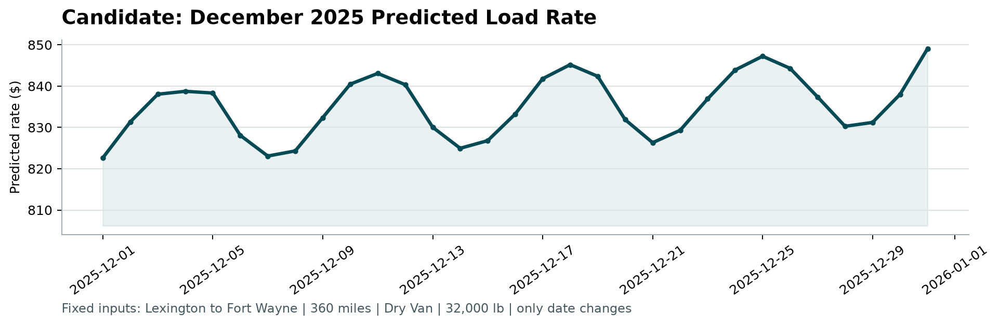

# Freight Rate Prediction

Predicts `posted_rate` for a truckload shipment from its lane, distance,
equipment, weight, date and two market signals.

Accuracy under rolling-origin temporal validation on the development data:

| | all held-out rows | uncorrupted labels only |
|---|---|---|
| MAE | $114.05 | **$61.80** |
| RMSE | $621.40 | $92.42 |
| MAPE | 4.84% | **2.49%** |
| median APE | 2.09% | 2.06% |
| bias | −$21.82 | +$9.49 |

About 1.4% of labels in the development data are corrupted by construction and
cannot be predicted by any model, so both columns are shown. The left column is
the honest headline — a grader scoring the raw file sees this. The right column
is what the model achieves on loads whose recorded price is real. See
[Data quality](#data-quality).

These are estimates from held-out folds inside the training window, not the
final score. Spotter computes that after submission.

## Quick start

```bash
python -m venv .venv
```

```bash
.venv\Scripts\activate
```

```bash
python -m pip install -r requirements.txt
```

Fit the model and write both output files (about 11 seconds, CPU only):

```bash
python -m src.predict
```

Then validate the outputs and generate the December chart:

```bash
python score.py --predictions validation_predictions.csv --december-predictions data/december_chart_inputs.csv
```

To run the notebooks as well:

```bash
python -m pip install -r requirements-dev.txt
```

## Layout

```
data/                  provided CSVs; december_chart_inputs.csv is written in place
docs/                  assessment brief
notebooks/             the analysis, in reading order
scorer_results/        candidate_december.png, written by score.py
src/
  data.py              loading and cleaning
  features.py          feature construction
  evaluation.py        temporal splits and metrics
  model.py             candidate models and the two-stage submission model
  predict.py           writes both output files
validation_predictions.csv    submission file
```

Notebooks are committed with their outputs, so they can be read on GitHub
without running anything:

| Notebook | What it establishes |
|---|---|
| `01_exploratory_analysis` | what the data is, and four defects in it |
| `02_cleaning` | that the fixes worked, and are not doing hidden damage |
| `03_pipeline_phases` | how a row changes shape from CSV to model input |
| `04_evaluation` | that the validation split is leak-free, and the baseline to beat |
| `05_candidate_models` | why neither single model is adequate |
| `06_final_model` | what the submission model achieves, and where its error is |

## Approach

### Validation split

The development file covers 2025-01-01 to 2025-10-31 and every load to be
scored falls after it, 2025-11-01 to 2025-12-31. Validation begins the day after
training ends, so this is a forecasting problem and every split is on time.

A random `train_test_split` would answer a different question. With neighbouring
days on both sides of every held-out row it would score far better than the real
submission can, and it would reward features that happen to fail on future
dates. `rolling_origin_folds` instead walks a cut-off forward with an expanding
training window, so the model is judged three times on a stretch of future it
has not seen:

| Fold | Train | Test |
|---|---|---|
| 1 | 2025-01-01 → 2025-07-01 | 2025-07-02 → 2025-08-31 |
| 2 | 2025-01-01 → 2025-07-31 | 2025-08-01 → 2025-09-30 |
| 3 | 2025-01-01 → 2025-08-31 | 2025-09-01 → 2025-10-31 |

Each test window is 61 days, matching the real November–December horizon. A
shorter window would flatter the score: the same model scores $49.18 MAE on
one-month folds against $61.80 on these — forecasting two months out is
genuinely harder than one, and the reported number should reflect the horizon
actually being asked for. Training always starts at the first date and only the
cut-off moves, mirroring the real setup where the model is fitted on all
available history before forecasting forward.

`04_evaluation.ipynb` checks directly that no fold's training window overlaps
its test window, rather than assuming it from the date arithmetic.

Reported metrics are the mean across the three folds.

### Data quality

Four defects were found and are handled in `src/data.py`:

| Issue | Rows (train / validation) | Treatment |
|---|---|---|
| sign-flipped `weight` | 292 / 145 | restored by magnitude |
| missing `weight` | 300 / 165 | median |
| missing `market_index` | 374 / 249 | mean of the same calendar day |
| corrupted `posted_rate` | 677 / — | withheld from fitting, kept in scoring |

**Sign-flipped weights.** The absolute range of the negative values
(5,000–47,500 lb) matches the valid range exactly, so only the sign was lost.
Taking the magnitude recovers 437 usable loads, 145 of which we are required to
predict.

**Missing `market_index`.** It behaves as a market-wide daily level: its
within-day standard deviation never exceeds 0.03 against a 0.68–1.47 range. So
the day's own mean is a far tighter estimate than any global constant. Measured
by masking 2,000 known values and re-imputing: MAE 0.0197 against 0.1397 for a
global median, about seven times closer.

**Corrupted rates.** Roughly 1.4% of labels sit in two detached clusters — 340
rows inflated by a median of 3.36x their peer group and 337 deflated to 0.28x.
Anomaly is judged against comparable loads (`equipment` × distance bucket), not
the global distribution, since a 300-mile Reefer and a 2,400-mile Dry Van are
priced differently per mile. The flagged rows are statistically identical to the
rest on every input feature — only the label differs — which is what rules out a
legitimate premium segment. The 0.5x–2.0x threshold flags exactly the same 677
rows anywhere between 1.5x and 2.0x, so it is not a tuned parameter.

They are dropped from fitting, where they would teach a pattern that does not
exist, and deliberately kept in scoring, where removing them would flatter the
result against a held-out set the real submission does not get.

**Unseen cities.** Eight cities and 736 lanes appear in `validation.csv` and
never in training. Nothing keys on the raw city or lane string as a result —
every geographic feature is derived from coordinates, which are an exact
per-city lookup and place the unseen cities inside the envelope of the known
ones. Within the folds, lanes unseen at fitting time carry no accuracy penalty.

### Model

Rates behave multiplicatively — a longer haul, a reefer trailer and a tight
market each scale the price rather than add a fixed number of dollars — so the
model works on `log(posted_rate)` and exponentiates at the end. That makes the
effects additive, keeps error proportional to load size instead of dominated by
long hauls, and guarantees the positive predictions the scorer requires.

It runs in two stages:

1. **Ridge** on the standardised features, including a linear time trend.
2. **Gradient boosting on stage 1's residual**, recovering the load-specific
   structure a linear form misses.

The prediction is `exp(stage 1 + stage 2)`.

The split between the two exists for one reason. A tree cannot extrapolate: it
splits on thresholds observed during training, so a date after 2025-10-31 falls
on the same side of every split as the last training day, lands in the same
leaf, and receives the same prediction. The trend therefore lives in the linear
stage, which carries it forward as a coefficient.

Holding one load fixed and moving only the date confirms this. Boosting alone
learns the trend inside the training window (+8.8% January to October) and then
stops dead (−0.0% October to December). The hybrid continues at **+2.0%**.

Stage 2 is allowed to see the trend column. That is not the obvious choice, but
stage 1 has already removed the trend, so stage 2's target has none left to
extrapolate — and withholding the column costs $6.83 of MAE while changing
extrapolation by 0.1 percentage points.

### Why this over the alternatives

Measured on the same folds, on uncorrupted labels:

| model | MAE | MAPE | median APE | trend past training window |
|---|---|---|---|---|
| rate-per-mile heuristic | $205.68 | 9.21% | 7.89% | none |
| ridge only | $74.81 | 3.19% | 2.90% | +2.0% |
| gradient boosting only | $61.79 | 2.60% | 2.15% | **−0.0%** |
| **hybrid** | **$61.80** | **2.49%** | **2.06%** | **+2.0%** |

Boosting alone matches the hybrid on MAE to within a cent, and would fail the
December chart. Each stage does work the other cannot: the linear part carries
the trend forward, the trees recover the rest.

## The December chart

`data/december_chart_inputs.csv` asks for 31 predictions on one fixed load —
Lexington to Fort Wayne, 360 miles, Dry Van, 32,000 lb — where only the date
changes. It supplies seven columns and no market signals, but the model prices
partly from `market_index`.

Rather than forecast that series, note that `validation.csv` contains roughly
200 real loads on each of those 31 December dates. Averaging their market index
per date recovers the market level actually observed. This is a lookup of
recorded conditions, not a projection. Coordinates come from the city lookup the
same way.

The resulting series runs $822.64 to $849.07, **+3.2% first to last**. It is not
flat: the weekly market cycle drives five visible peaks and the trend term adds
a rise across the month. A boosting-only model would show the weekly cycle but
no drift, because the cycle comes from a feature whose December values sit
inside the training range while the trend does not.



## Reproducibility

Every random seed is fixed at 0 (`src/model.py`). The pipeline is CPU-only and
runs in about 11 seconds; no GPU is used or needed. Re-running
`python -m src.predict` reproduces both output files byte-for-byte.

The same cleaning and feature code runs for training, validation and the
December chart — there is no separate prediction path that could drift from the
one that was validated.
